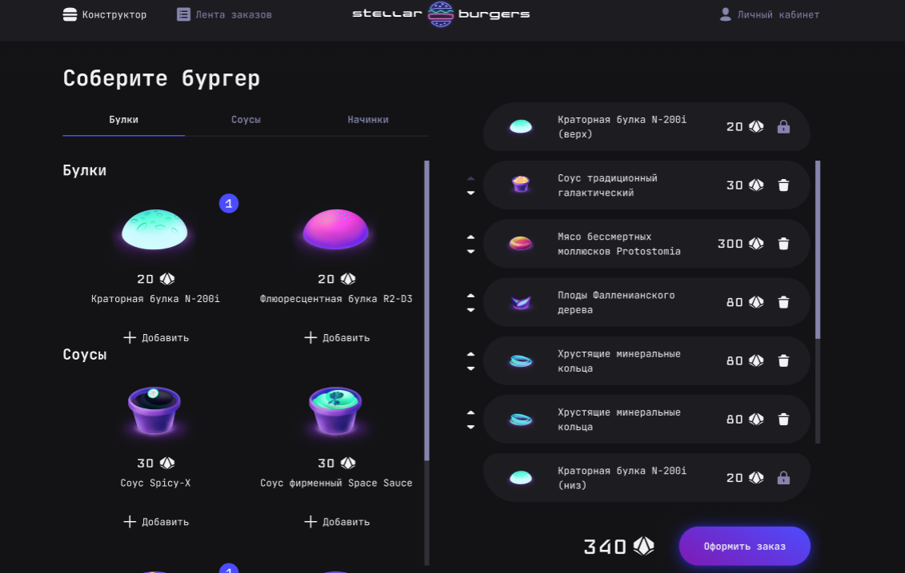

# Приложение для заказа бургеров
Сервис, позволящющий зарегистрироваться, собрать бургер с помощью конструктора из представленныйх на странице ингридиентов и оформить заказ. История заказов отображается в личном кабинете. Также на странице "Лента заказов" отображаются все заказы с их статусом.


## Реализованный функционал:
- Страница конструктора бургера:
    * отображается список ингредиентов, загруженный с сервера;
    * при клике на ингредиент открывается модальное окно с детальным описанием ингредиента;
    * при нажатии кнопки «Добавить» ингредиента он добавляется в конструктор бургера;
    * овормление заказа авторизованным пользователем;
    * при успешном запросе оформления заказа отображается модальное окно с данными заказа.
- Страница ленты заказов:
    * отображается список заказов, полученный с сервера;
    * при нажатии кнопки «Обновить» список заказов повторно запрашивается с сервера и данные обновляются на странице;
    * при клике на заказ открывается модальное окно с детальным его описанием.
- Регистрация и авторизация пользователя, восстановление пароля;
- Страница профиля:
    * редактирование данных пользователя;
    * просмотр истории заказов;

## Что сделала:
- Настроила роутинг;
- Написала функционал запросов данных с сервера, используя `Redux` и глобальный `store`;
- Настроила авторизацию и создала защищённые роуты;
- Написала юнит-тесты на `Jest` для слайсов и интеграционные тесты `Cypress` для страницы конструктора бургера.

## Технологии:
- TypeScript, React, React Router, Redux

## Инструкция по запуску:
1. Создайте папку и перейдите в нее
```
cd <имя_папки>
```
2. Склонируйте этот репозиторий
```
git clone https://github.com/Gelen8/stellar-burgers.git
```
3. Установите зависимости
```
yarn или npm install
```
4. Запустите проект
```
npm start или yarn start
```
5. **Важно.** Для корректной работы запросов к серверу необходимо добавить переменную BURGER_API_URL в окружение. Сама ссылка находится в файле `.env.example`.
